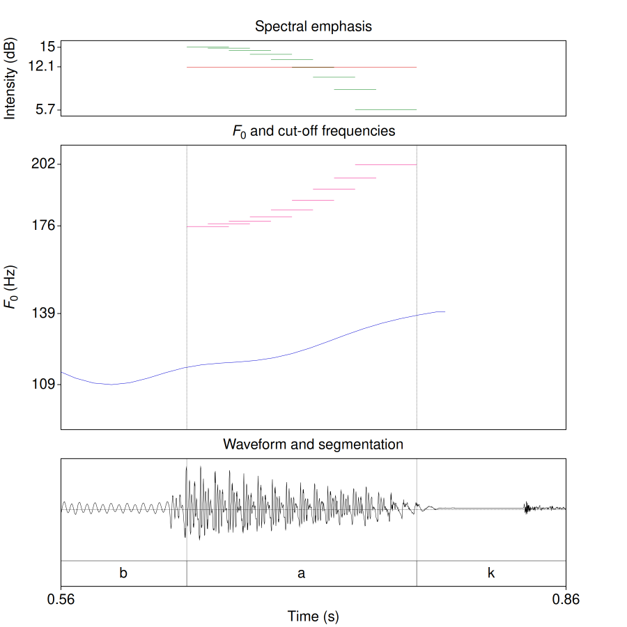

# spectral-emphasis.praat

Praat script to measure spectral emphasis.

## Purpose

Measures spectral emphasis in selected intervals. Emphasis is defined as the difference (in dB) between the overall intensity and the intensity in a signal that is low-pass filtered at 1.5 times the F0 mean in a window with default width of 25 ms. Within each analysis interval the window advances with a default step of half window width to follow the F0 contour. It is thought to reflect the relative contribution of the high-frequency band to the overall intensity. See Traunmüller and Eriksson 2000 (JASA v. 107(6), 3438-3451) and Heldner 2003 (Journal of Phonetics, v. 31, 39-62) for more details.

## How to cite

Click on the DOI badge above to see instructions on how to cite the script.

## Changelog

See the [CHANGELOG](CHANGELOG.md) file for the complete version history.

## License

See the [LICENSE](LICENSE.md) file for license rights and limitations.

## References

Heldner, M. (2003). On the reliability of overall intensity and spectral emphasis as acoustic correlates of focal accents in Swedish. Journal of Phonetics, 31, 39–62.

Traunmüller, H., & Eriksson, A. (2000). Acoustic effects of variation in vocal effort by men, women, and children. The Journal of the Acoustical Society of America, 107(6), 3438–3451.
